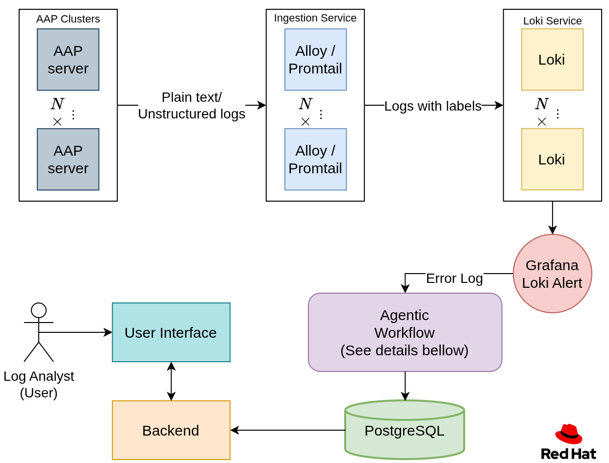
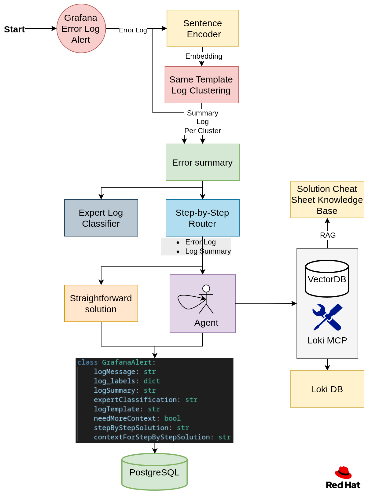
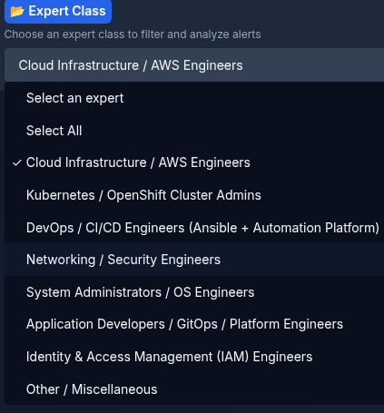
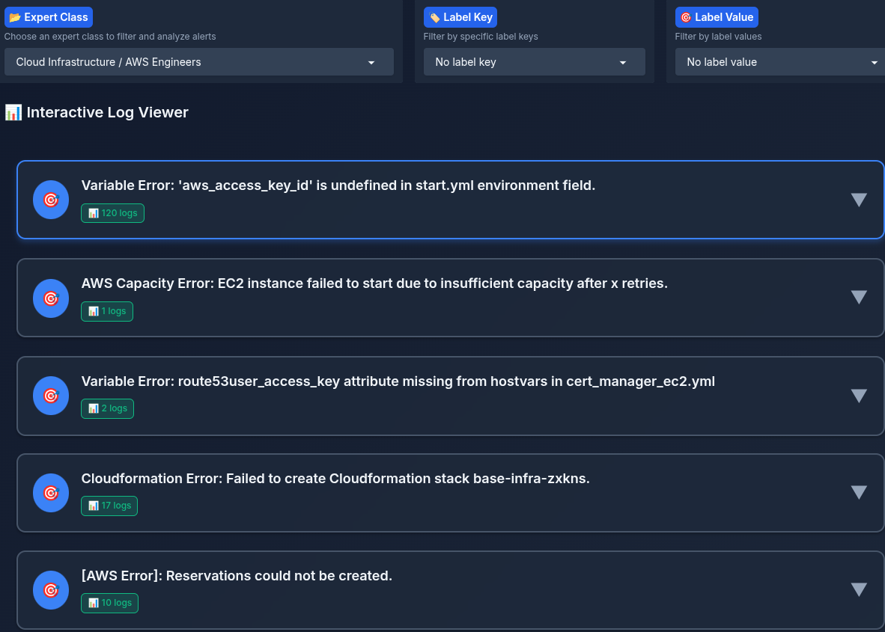
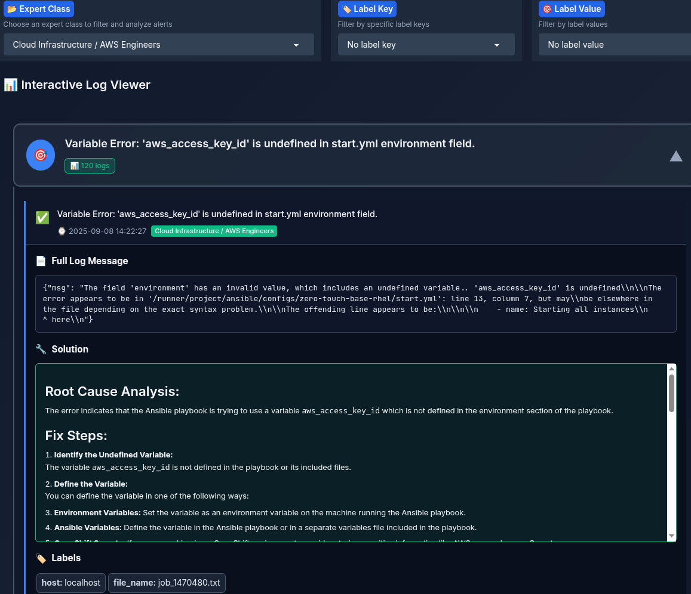
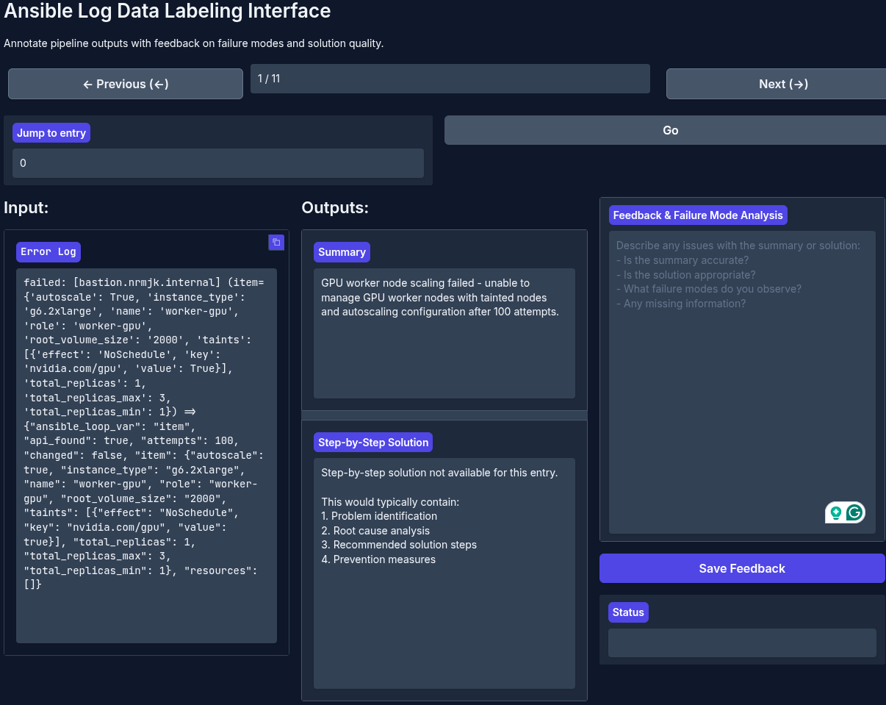

# Agent Assistant for Log Analysis – Quick Start

An AI agent for AAP clusters that detects Ansible log errors, suggests step-by-step fixes using cluster-wide logs, and routes issues to the right experts.

## Table of contents

1. [Detailed description](#detailed-description)
   - [The Challenge](#the-challenge)
   - [Our Solution](#our-solution)
   - [Current Manual Process](#current-manual-process)
   - [Our Solution Stack](#our-solution-stack)
   - [Architecture diagrams](#architecture-diagrams)
2. [Requirements](#requirements)
   - [Minimum hardware requirements](#minimum-hardware-requirements)
   - [Minimum software requirements](#minimum-software-requirements)
   - [Required user permissions](#required-user-permissions)
3. [Deploy](#deploy)
   - [Quick Start - OpenShift Deployment](#quick-start---openshift-deployment)
   - [Quick Start - Local Development](#quick-start---local-development)
   - [Usage](#usage)
   - [Delete](#delete)
4. [References](#references)
5. [Tags](#tags)

## Detailed description

### The Challenge


Organizations running Ansible automation at scale face significant challenges when errors occur. Log analysis is manual, time-consuming, and requires specialized knowledge across multiple domains (AWS, Kubernetes, networking, etc.). When failures happen, teams spend valuable time searching through logs, identifying the right experts, and waiting for solutions.

### Our Solution

An AI-powered log analysis system that automatically:
- Detects and categorizes Ansible errors in real-time
- Routes issues to appropriate experts based on authorization levels
- Provides contextual, step-by-step solutions using AI agents
- Learns from historical resolutions to improve future recommendations

### Current Manual Process

A human analyst is:

* Searches for error logs.  
* Talks with the person who is authorized with the credentials to solve the problem:  
  * Examples:   
    AWS provisioning failure requires talking with the AWS person who is authorized.  
    Bug in the playbook source code \- talk with the programmer.  
* The authenticated person needs to **understand how to solve the problem**.  
* Solve the problem.

### Our Solution Stack

#### Log Management
* Loki - time-series log database that is used for storing Ansible logs, aggregation and querying.
* Alloy/Promtail - log collection agents for ingestion from the AAP cluster.
* Grafana - alerting on error patterns and dashboard visualization.

#### AI/ML Platform
* OpenShift AI - model serving, data science pipelines, 
  and notebook environment.
* LLM - powers summarization, classification, and solution 
  generation (served via RHOAI model serving or any 
  OpenAI-compatible endpoint).

#### Backend Services
* FastAPI - REST API endpoints for alerts, queries, and pipeline orchestration.
* LangGraph - build the agent.
* MCP (Model Context Protocol) - tool integration for Loki queries and Ansible code retrieval.
* PostgreSQL - persistent storage for processed alerts and metadata.

#### Embeddings & Retrieval
* Sentence Transformers - log clustering by template similarity.
* TEI (Text Embeddings Inference) - high-performance embedding service for RAG.
* FAISS - vector similarity search for knowledge base retrieval.
* MinIO - object storage for RAG index persistence.

#### Observability
* Phoenix + OpenTelemetry - distributed tracing for LLM calls and pipeline monitoring.

#### User Interfaces
* UI (Gradio) - expert-facing dashboard for browsing alerts and solutions.
* Annotation Interface (Gradio + DeepEval) - human annotation, evaluation, and workflow improvement.

### Architecture diagrams

#### High-Level Solution

1. Data is being **ingested** from the Red Hat Ansible Automation Platform (AAP) clusters, using Alloy or Promtail, into Loki (a time series database designed for logs).  
2. An **error log is alerted** using a Grafana alert and sent into the agentic workflow.  
3. The **agentic workflow** processes the log and stores the processed data into a PostgreSQL database.  
4. The log analyst using the **UI** interacts with the logs and gets suggestions on how to solve the error, depending on their authorization. 



#### Agentic Workflow



#### Step 1: Embedding and Clustering

Many logs are generated from the same log template. To group them, we embed a subset of each log, then cluster all the embeddings into groups. Each group represents a log template. For example, let’s look at the following three logs:

```
1. error: user id 10 already exists.
2. error: user id 15 already exists.
3. error: password of user itayk is wrong.
```

As we can see here, logs 1 and 2 are from the same template, and we want to group them together.

Then the user will be able to filter by templates.

#### Step 2: Summary and Expert Classification per Log Template

For each log template, create a summary of the log and classify it by authorization.  
For example, an analyst who has AWS authentication will filter by their authorization and will see only relevant error summaries in the UI.

#### Step 3: Creating a step-by-step solution

We will have a router that will determine if we need more context to solve the problem or if the log error alone is sufficient to generate the step-by-step solution.  
If we need more context, we will spin up an agent that will accumulate context as needed by using the following:

* **Loki MCP**, which is able to query the log database for additional log context. This project uses an [enhanced fork](https://github.com/RHEcosystemAppEng/loki-mcp/tree/downstream/loki-mcp-for-alm) with additional query capabilities.
  
* **RAG** for retrieving an error cheat sheet of already solved questions.  
* **Ansible MCP** for obtaining code source data to suggest a better solution.

#### Step 4: Store the data

* Store a payload of the generated values for each log in a PostgreSQL database.

#### Training and Inference stages

Currently, the **only difference** between the training and inference stages is the clustering algorithm.

##### Training

Train the clustering algorithm to cluster the logs by log-template.

##### Inference

Load the trained clustering model.

## Requirements

### Minimum hardware requirements 

CPU: 3-4 cores  
Memory: 10Gi  
Storage: 50Gi-200Gi  
- 50Gi for using the mock data  
- For a large amount of logs, this needs to be increased

### Minimum software requirements

#### OpenShift Cluster Deployment
- **Red Hat OpenShift AI** 2.25.0 or later (for model serving and data science workloads)
- **Helm** 3.0.0 or later
- **oc CLI** (for OpenShift)
- **LLM Model Server** — Red Hat OpenShift AI model serving (vLLM) recommended for hosting your LLM with enterprise features or OpenAI cradetionals

#### Local Development Requirements
- Podman and Podman Compose or Docker and Docker Compose 
- `uv 0.9.x` package manager with Python 3.12+
- Make (for running deployment commands)

### Required user permissions

#### Local Development

- Permission to run containers via Docker or Podman
- Access to local ports: `3000`, `3100`, `5432`, `6006`, `7860`, `7861`, `8000`, `8080`, `8081`

#### OpenShift Cluster Deployment

- Authenticated to the OpenShift cluster (`oc login`)
- Permission to create or access a namespace/project


## Deploy

The Ansible Log Monitor can be deployed in **local** or **cluster** deployments depending on your needs. Choose the deployment method that best fits your requirements:

### Quick Start - OpenShift Deployment

For production deployment on OpenShift clusters:

```bash
# Install in your current namespace
make cluster/install

# Or specify a different namespace
make cluster/install NAMESPACE=ansible-logs-monitor
```

During installation, you'll be prompted to configure:
- API token
- LLM endpoint URL — Red Hat OpenShift AI model serving (vLLM) is the recommended option. Alternatively, any OpenAI-compatible endpoint can be used.
- Model name (e.g., the model deployed on your RHOAI model server)
- Temperature (optional — defaults are provided)


#### Additional commands

```bash
# upgrade
make cluster/upgrade

# restart
make cluster/restart
```

### Quick Start - Local Development

For development and testing, you can run all services locally using the provided Makefile:

#### Deploy Locally

Follow these steps to set up and run the Ansible Log Monitor on your local development environment:

##### 1. Clone and Setup Repository

```bash
# Clone the repository
git clone https://github.com/rh-ai-quickstart/ansible-log-analysis.git
cd ansible-log-analysis
```

##### 2. Configure Environment Variables

```bash
# Copy the environment template and configure your settings
cp .env.example .env
```
Edit `.env` with your API keys and configuration:
```bash
OPENAI_API_ENDPOINT: # LLM endpoint URL - use your Red Hat OpenShift AI (RHOAI) model serving endpoint for enterprise deployments, or any OpenAI-compatible endpoint (some endpoints need /v1 suffix)
OPENAI_API_TOKEN: # Your token to the endpoint (RHOAI service account token or API key)
OPENAI_MODEL: # Model to use (e.g., the model deployed on your RHOAI vLLM server)
LANGSMITH_API_KEY: # Optional, for LangSmith tracing
```

> **💡 Tip:** For enterprise deployments, we recommend using [Red Hat OpenShift AI model serving](https://docs.redhat.com/en/documentation/red_hat_openshift_ai_self-managed/3.0/html/deploying_models/deploying_models?utm_source=chatgpt.com#deploying-models-on-the-model-serving-platform_rhoai-user) to host your LLM. RHOAI provides vLLM-based model serving with built-in GPU support, autoscaling, and enterprise security features.

##### 3. Start All Services

In short:
```bash
make local/install
make local/train
```

```bash
# Launch all services in the background
make local/install

# Run the complete training pipeline (do it after local/install)
make local/train

# Perform status check to see which services are running
make local/status

# uninstall all services when done
make local/uninstall
```

##### Additional Commands

```bash
# Restart all services
make local/restart

# View all available local commands
make local/help
```

### Usage

After the installation is complited look at the routes from openshift or using the command line
```bash
oc ...
```

in lcoal deployment you will neet to go to the urls
For the user insterface:

For the annotation interface and evaluation system

#### User Interface

* Each expert selects their role, depending on their authorization. Current rules are:  
  * Kubernetes / OpenShift Cluster Admins  
  * DevOps / CI/CD Engineers (Ansible \+ Automation Platform)  
  * Networking / Security Engineers  
  * System Administrators / OS Engineers  
  * Application Developers / GitOps / Platform Engineers  
  * Identity & Access Management (IAM) Engineers  
  * Other / Miscellaneous  
* Each expert can filter by labels (cluster\_name, log\_file\_name, …)  
* A summary of each log is listed to the expert, the expert can click on the log summary and view the whole log, and a step-by-step solution, timestamp, and labels



After selecting the authorization class "expert":





#### Annotation Interface

For improving our agentic workflow, context PDFs, and other context, we need to understand the errors. To do so, we have a data annotation interface for annotating Ansible error log pipeline outputs.  
We see the agentic workflow:

* **Input** of the left (error log)  
* **Outputs** in the center (summary, and step-by-step solution)  
* **Annotation window** on the right.

See the interface below:




### Delete

#### Delete from OpenShift

```bash
# Remove from current project
make cluster/uninstall

# Remove from specific namespace
make cluster/uninstall NAMESPACE=ansible-logs-monitor
```


#### Stop Local Deployment

```bash
# uninstall all services when done
make local/uninstall
```

<!-- ## References  -->

## References 
- [How to deploy language models with Red Hat OpenShift AI](https://developers.redhat.com/articles/2025/09/10/how-deploy-language-models-red-hat-openshift-ai#)


## Tags

* Title: Ansible Agent AI Log Analysis
* Description: An AI agent for AAP clusters that detects Ansible log errors, suggests step-by-step fixes using cluster-wide logs, and routes issues to experts.
* Industry: Adopt and scale AI
* Product: Red Hat OpenShift AI, Ansible Automation Platform
* Use case: Log Analysis, Analyst Assistant, Intelligent Troubleshooting
* Contributor org: Red Hat
